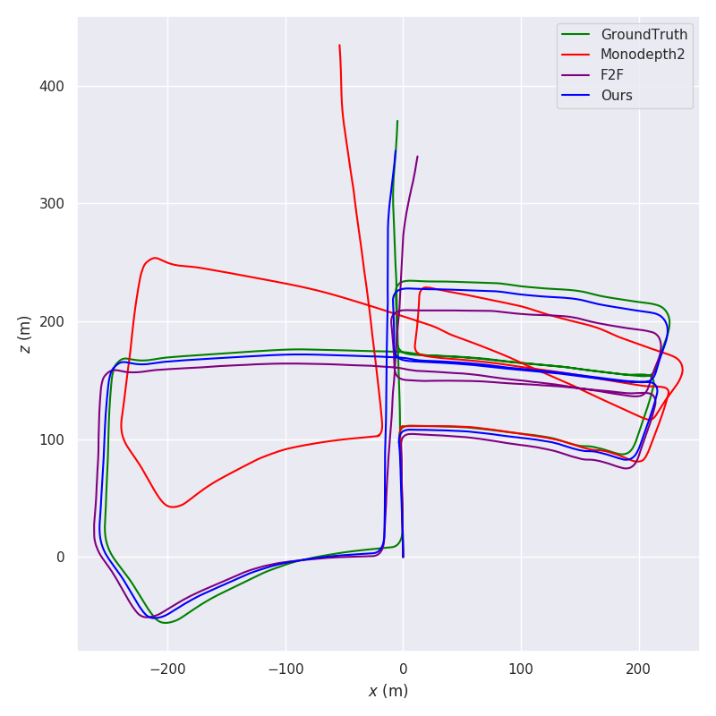
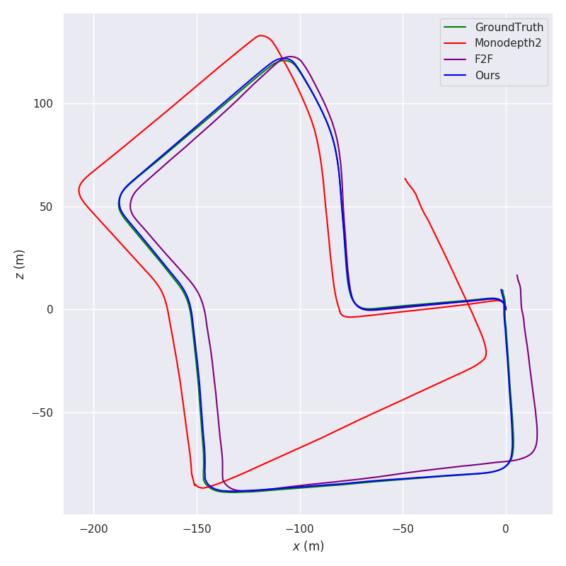

# Self-Supervised 3D Keypoint Learning for Ego-Motion Estimation

**Accepted as Plenary talk at CoRL 2020.**

## Overview


- **Sparse mono-SfM:** A new framework for the simultaneous learning of keypoint detection, matching and 3D lifting by incorporating a differentiable pose estimation module.
- **Multi-view adaptation:**  A novel adaptation technique that exploits the temporal context in videos to further boost the repeatability and matching performance of the keypoint network. 
- **State-of-the-art performance:** We integrate the networks into a visual odometry framework, enabling robust and accurate ego-motion estimation results

[**[Full paper]**](https://arxiv.org/abs/1912.03426) [**[YouTube]**](https://youtu.be/bWqGU9zoH9I)

### Setting up your environment

You need a machine with recent Nvidia drivers and a GPU. We recommend using docker (see [nvidia-docker2](https://github.com/NVIDIA/nvidia-docker) instructions) to have a reproducible environment. To setup your environment, type in a terminal (only tested in Ubuntu 18.04):

```bash
git clone https://github.com/TRI-ML/KP3D.git
cd KP3D
# if you want to use docker (recommended)
make docker-build
```

We will list below all commands as if run directly inside our container. To run any of the commands in a container, you can either start the container in interactive mode with `make docker-start` to land in a shell where you can type those commands, or you can do it in one step:

```bash
# single GPU
make docker-run COMMAND="some-command"
# multi-GPU
make docker-run-mpi COMMAND="some-command"
```

### Data

Download the HPatches dataset for evaluation:

```bash
cd /data/datasets/kp3d/
wget http://icvl.ee.ic.ac.uk/vbalnt/hpatches/hpatches-sequences-release.tar.gz
tar -xvf hpatches-sequences-release.tar.gz
mv hpatches-sequences-release HPatches
```

Download the KITTI odometry dataset from [here](http://www.cvlibs.net/datasets/kitti/eval_odometry.php) - get the color images and ground truth poses. Unzip the data in `/data/datasets/kp3d/KITTI_odometry/`. 

### Pre-trained models:

Download the pre-trained models from [here](https://tri-ml-public.s3.amazonaws.com/github/kp3d/pretrained_models.tar.gz) and place them in `/data/models/kp3d/`.

To replicate our results on the KITTI odometry dataset (Table 1 - Ours), run:

 
```bash
make docker-run-mpi COMMAND="python kp3d/evaluation/evaluate_keypoint_odometry.py --depth_model /data/models/kp3d/depth_resnet.ckpt --keypoint_model /data/models/kp3d/keypoint_resnet.ckpt --dataset_dir /data/datasets/kp3d/KITTI_odometry/dataset/ --output_dir ./pose_output/ --sequence 01 02 06 08 09 10 00 03 04 05 07 --align_trajectory --run_evaluation"
```

You should get the following results: 

| Sequence | 01 | 02 | 06 | 08 | 09 | 10 | 00 | 03 | 04 | 05 | 07 | Mean Train | Mean Test |
|---|---|---|---|---|---|---|---|---|---|---|---|---|---|
t_rel | 17.60 |	3.22 | 1.84 |	3.05 | 2.73 |	5.08 |	2.73 | 3.03	 | 2.21 | 3.53 | 2.42 | 5.58 | 2.79 |
r_rel | 0.62	|1.01	|0.75	| 0.73 |	0.63 |	0.97 |	1.09 |	2.42 | 1.97	| 1.18 | 1.00	| 0.79 |	1.53 |

To replicate our results on the HPatches dataset (Table 4 - KeypointNet), run:

```bash
make docker-run COMMAND="python kp3d/evaluation/evaluate_keypoint_patches.py --pretrained_model /data/models/kp3d/keypoint_resnet.ckpt --input /data/datasets/kp3d/HPatches/"
```

You should get the following results:

Evaluation for **`(320, 256)`**:

| Repeatability |	Localization |	C1 |	C3 | 	C5 |	MScore |
|---|---|---|---|---|---|
|	0.686 |	0.800 |	0.514 |	0.867 |	0.914  |	0.588 |


Evaluation for **`(640, 480)`**:

| Repeatability |	Localization |	C1 |	C3 | 	C5 |	MScore |
|---|---|---|---|---|---|
|	0.674 |	0.886 |	0.526 |	0.857 |	0.921  |	0.535 |


The numbers deviate slightly from the paper, due to different dependency versions.

## Trajectories
Trajectories of DS-DSO on KITTI odometry sequences 00-10: [ds_dso_kitti_00_10.zip](https://raw.githubusercontent.com/TRI-ML/KP3D/master/trajectories/ds_dso_kitti_00_10.zip?token=AFNBHBZSND3KKTPGUO3OKXC56SEBM).
We also include the results of our ablative analysis as well as our evaluation of [monodepth2](https://github.com/nianticlabs/monodepth2).

<p align="center">
  
  
</p>

## License

The source code is released under the [MIT license](LICENSE.md).


## Citation
Please use the following citation when referencing our work:
```
@inproceedings{tang2020kp3d,
  title = {{Self-Supervised 3D Keypoint Learning for Ego-Motion Estimation}},
  author = {Jiexiong Tang and Rares Ambrus and Vitor Guizilini and Sudeep Pillai and Hanme Kim and Patric Jensfelt and Adrien Gaidon},
  booktitle={Conference on Robot Learning (CoRL)},
  year={2020},
}
```